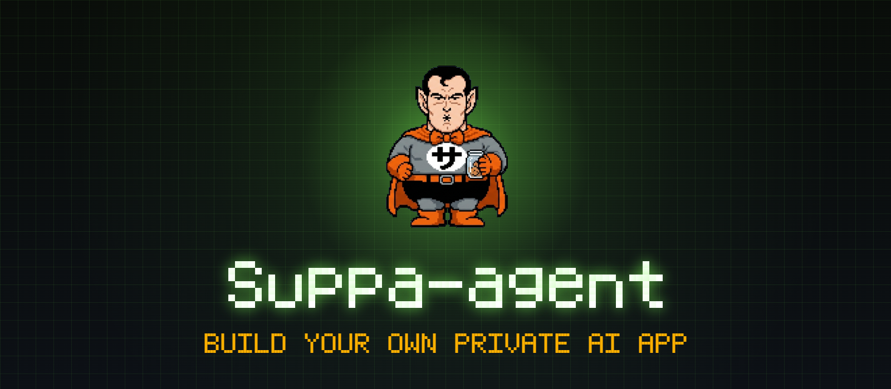

  

  <b>Build your own private AI app in 30 minutes. Zero cost. Zero coding.</b>

  
  
  
  
  

---

suppa-agent turns a free Claude conversation into a fully deployed AI chat app — running on your Firebase, accessible only to people you invite, powered by Gemini's 1-million-token context window.

No subscriptions. No shared servers. No data leaving your account. Just your app, your database, your rules.

---

## How it works

1. Go to [**polcuadro.github.io/suppa-agent**](https://polcuadro.github.io/suppa-agent) — fill in 4 fields (name, slug, email, API key)
2. Copy the generated commands to Claude Code
3. Claude Code sets up Firebase, generates all files, and deploys automatically
4. Do 2 manual steps in Firebase Console when Code tells you (Blaze upgrade + enable Google Auth)
5. Done. Your app is live at `https://your-app.web.app`

Claude Code does the heavy lifting — ~20 minutes from start to deployed app.

---

## What you get

A real web app that you own:

- **Your own URL** — `https://your-app.web.app`
- **Google login** — only the emails you authorize can enter
- **AI chat with memory** — conversations persist across sessions, never lost
- **1 million tokens of context** — 8x what ChatGPT gives you on a free plan
- **User management** — add or remove people from inside the app
- **Dark, clean interface** — works on desktop and mobile

Your conversations live in your Firestore database, under your Google account. Nobody else can read them.

---

## Why build your own?

Because the alternatives all take something from you.

| | ChatGPT / others | suppa-agent |
|---|---|---|
| Context window | 128k (free tier) | **1M tokens** |
| Your conversations | On their servers | **Your Firestore** |
| Monthly cost | $20+ for decent access | **$0** |
| Who decides the rules | They do | **You do** |

If you have a family, a small team, or a group of friends that could use a private AI — this gets you there in an afternoon.

---

## What it costs (really)

| Service | What you use | Cost |
|---|---|---|
| Gemini API (2.5 Flash) | Free tier | $0 |
| Firebase Hosting | Under 1 GB | $0 |
| Firestore | A few thousand ops/day | $0 |
| Cloud Functions | A few hundred calls/day | $0 |
| **Total** | | **$0/year** |

We set up a $5/month spending alert during the wizard so there are no surprises.

---

## Tech stack

- **Frontend:** React + Vite on Firebase Hosting
- **Backend:** Cloud Functions (Node.js 22) with Gemini 2.5 Flash
- **Database:** Firestore (real-time, persistent chat)
- **Auth:** Firebase Authentication (Google Sign-In)
- **Context:** 1M tokens per conversation via Gemini API (free tier)

---

## Requirements

- Claude Pro with Claude Code
- A Google account
- A credit card for Firebase Blaze ($0 cost)
- 20 minutes

---

## The files that matter

| File | What it does |
|---|---|
| [`WIZARD.md`](./WIZARD.md) | The spec Claude reads to build the wizard |
| [`MANUAL.pdf`](./docs/MANUAL.pdf) | Complete reference — architecture, deploy, troubleshooting |
| [`suppa-agent-wizard.jsx`](./suppa-agent-wizard.jsx) | Wizard source (auto-generated by Claude) |

Upload `WIZARD.md` + `MANUAL.pdf` to Claude. That's all you need.

---

## License

[MIT](./LICENSE) — use it however you want.

---

Built by [@polcuadro](https://github.com/polcuadro). Powered by Claude + Gemini.

If this helped you, ⭐ the repo — that's how we know it's worth maintaining.
